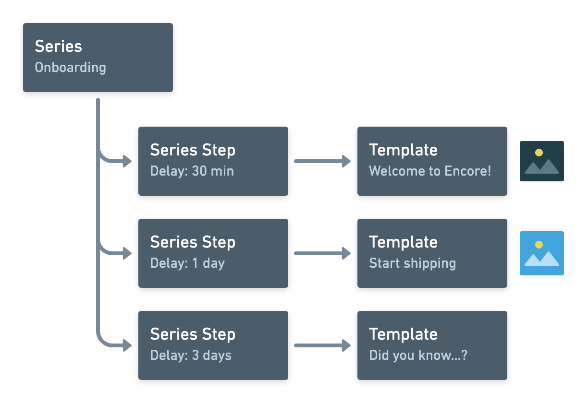

# drip

This is a simple Encore application to create onboarding email series.

It uses [Strapi](https://strapi.io) for content management and
[Mailgun](https://mailgun.com) for sending emails.

## Data model

The data model is hosted in Strapi and queried through its GraphQL API.

## Using

To use, update the configuration in
`email/config.json` to point to the
Strapi API URL.

Then deploy the app to [Encore](https://encore.dev). Finally, set the secrets deifned in `email/cfg.go` to the appropriate values.
